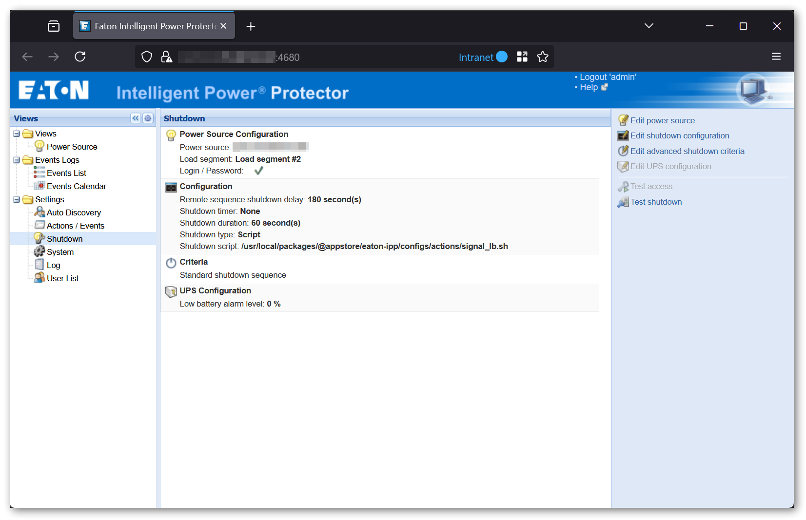

# Eaton® Intelligent Power® Protector for Synology® DSM 7

[![MIT License][license-shield]][license-url]
[![Contributors][contributors-shield]][contributors-url]
[![Forks][forks-shield]][forks-url]
[![Stargazers][stars-shield]][stars-url]
[![Issues][issues-shield]][issues-url]

<!-- markdownlint-disable MD033 -->

<br />

<div align="center">
  <a href="https://github.com/flobernd/eaton-ipp-synology">
    <picture>
      <source media="(prefers-color-scheme: dark)" srcset="images/eaton-logo-dark.png" width="auto" height="80px">
      <source media="(prefers-color-scheme: light)" srcset="images/eaton-logo.png" width="auto" height="80px">
      
    </picture>
  </a>
  <h3 align="center">Eaton® Intelligent Power® Protector for Synology® DSM</h3>
  <p align="center">
    Build Eaton® Intelligent Power® Protector for Synology® DiskStation Manager (DSM) 7
    <br />
    <a href="https://www.eaton.com/us/en-us/catalog/backup-power-ups-surge-it-power-distribution/eaton-intelligent-power-protector.html">
      <strong>Explore the official Eaton® IPP documentation</strong>
    </a>
    <br />
    <br />
  </p>
</div>

<!-- markdownlint-enable MD033 -->

## About the Project



Eaton's Intelligent Power Protector (IPP) software provides graceful, automatic shutdown of network devices during a prolonged power
disruption, preventing data loss and saving work-in-progress.

Eaton IPP is distributed on the offical
[download page](https://www.eaton.com/us/en-us/forms/backup-power-ups-surge-it-distribution/eaton-intelligent-power-protector-software-download-form.html)
for multiple platforms, however - as of today - Eaton does not provide a native DSM package.

Although DSM 7 provides integrated functionality for generic UPS monitoring via NUT, it lacks the necessary configuration options to
precisely control the shutdown time of the NAS in the overall shutdown sequence.

Eaton IPP for DSM connects your protected Synology NAS directly to the UPS Network Management Card, enabling centralized management of the
shutdown sequence. Key benefits include:

- Fine-grained control over the timing of shutdown events
- Flexible configuration of shutdown order and delays across multiple agents
- Assignment of specific power sources or output groups (main, outlet 1, outlet 2)
- Seamless integration with Eaton Intelligent Power Manager (IPM)

With this solution, you can apply consistent shutdown conditions across both IPP agents and IPM-managed servers. For example, you can
ensure the NAS is only powered down after dependent systems, such as servers or clusters, have been safely shut down.

This repository contains tooling to build and package Eaton IPP for Synology DSM 7 using the official Eaton IPP deb installer package.

## Build the Package

There are two primary ways to build this package, depending on your preferred workflow.

### 1. Using the provided Docker Builder Image

A pre-configured Docker builder image is available to streamline the build process. Use the following commands to build the Eaton IPP
package. The Docker builder image is created on demand. Please note that the initial run may take some time, as the Synology Toolkit will
be downloaded during this process:

```bash
git clone https://github.com/flobernd/eaton-ipp-synology

cd build
./build.sh
```

After the build process completes, the final package artifacts will be located in the `build/packages` directory.

> [!NOTE]
> To speed up subsequent builds, both the Docker image and the Docker container are retained.
If you no longer need them, you can remove both manually by running:
>
> ```bash
> docker rm -f dsm-builder-eaton-ipp
> docker rmi -f flobernd/dsm-builder-epyc7002-7.2:latest
> ```

### 2. Manual Build with Synology Developer Toolkit

Alternatively, you can build the package manually using the Synology Developer Toolkit. This approach is ideal if you already have the
toolkit installed or prefer a more hands-on build process.

Detailed setup- and build instructions are available in the official
[Synology Developer Toolkit guide](https://help.synology.com/developer-guide/getting_started/prepare_environment.html).

## Install the Package

Open the "Package Center" and select "Manual Install." Choose the `eaton-ipp-x86_64-*.spk` package file and complete the wizard to install
it.

Check the "Run after installation" option if you want the package to start automatically after installation.

If you want to manually start or stop the package later, you can do so from the DSM Package Center.

## Configure UPS Monitoring in DSM

To enable native UPS monitoring functionality in Synology DSM and to configure it to monitor the Eaton IPP proxy UPS, follow these steps:

1. Navigate to **Control Panel** > **Hardware & Power** > **UPS**.
2. Ensure that **Enable UPS support** is checked.
3. Set the **UPS type** to **Synology UPS Server**.
4. For **Network UPS server IP**, enter the IP address of your NAS (any network interface will work).
5. Go to **Control Panel** > **Hardware & Power** > **General** and make sure that **Restart automatically when power supply issue is fixed**
   is checked.

To verify the setup, click the **Device Information** button in the DSM UPS settings. This should display some static data, such as:

- **Model:** Eaton Intelligent Power Protector Relay

If you see this information, the Eaton IPP proxy UPS integration is working as expected.

> [!IMPORTANT]
> It is important to configure a static IP address for your NAS. If the NAS uses a dynamic IP (via DHCP), it may lose connection to the
> UPS proxy server, resulting in unreliable UPS monitoring and shutdown functionality.

<details>
  <summary>Additional context</summary>

  Synology DSM uses [NUT (Network UPS Tools)](https://networkupstools.org/) under the hood for its native UPS monitoring.

  The Eaton IPP NUT proxy server runs locally on the NAS, which would suggest that `127.0.0.1` (the loopback address)
  could be used as the Network UPS server IP. Unfortunately, Synology's configuration UI enforces strict validation and
  does not allow entering the loopback IP, so this is not possible - even though it would be the most straightforward solution.

</details>

## Configure IPP

Access the IPP web interface to begin configuration. The default login credentials are `admin` for both username and password.

After logging in, navigate to the "Auto Discovery" menu to detect and connect to your UPS. Once connected, go to the "Shutdown" menu to
configure the detected power source and specify the corresponding outlet/group.

For more detailed information about configuration options and advanced settings, refer to the
[official Eaton IPP User Guide (PDF)](https://www.eaton.com/content/dam/eaton/products/backup-power-ups-surge-it-power-distribution/power-management-software-connectivity/eaton-intelligent-power-protector/eaton-ipp-user-guide-p-164000291.pdf).

**Important:** In the "Shutdown" > "Configuration" section, ensure that you retain the default settings for both "Shutdown Type" and
"Shutdown Script". Any other value **will not work**!

The default values are:

- "Shutdown Type": `Script`
- "Shutdown Script": `/usr/local/packages/@appstore/eaton-ipp/configs/actions/signal_lb.sh`

> [!WARNING]
> Changing these options will prevent the shutdown functionality from working properly.

> [!NOTE]
> If the configuration is incorrect, the package will display a warning at startup.

### Test the Shutdown Command

It is highly recommended to verify the shutdown behavior by using the "Test shutdown" option found in the "Shutdown" section of the IPP
web-interface.

If everything is functioning correctly, DSM should enter safe mode after a few seconds, unmounting all volumes and stopping all services.
SSH access will remain available in this state. To exit safe mode, you must either power cycle the device (this is totally safe to do in
this state) or, alternatively, execute `sudo /sbin/reboot` via SSH.

## Disclaimer

When battery power is low, the native DSM UPS integration will place the NAS into safe mode rather than fully shutting it down.

Synology has made a - in my opinion - questionable design decision by implementing an automatic reboot mechanism: if the main power
returns before the UPS is exhausted or its shutdown sequence is completed (i.e., while the NAS is still powered by the UPS), DSM will
automatically exit safe mode and restart the system.

While this behavior makes sense in simple scenarios where the UPS is directly attached to the NAS and no other devices are connected
(or all other devices have a similar recovery functionality), it does not make sense in advanced setups involving network UPS powering
multiple devices. In this case, the UPS is most of the times configured to keep the shutdown sequence running until the end - even when
power returns - in order to power cycle all devices (forced reboot).

If DSM initiates its own reboot before the UPS has completed its shutdown sequence, the NAS becomes susceptible to an improper shutdown
when power is lost again. This behavior ultimately defeats the purpose of the UPS and undermines the protection it is designed to provide.

With the Eaton IPP UPS proxy, the standard automatic reboot behavior of DSM does not work. This is because the proxy does not continuously
monitor the UPS status, but simply reacts to an event triggered by the shutdown script configured in IPP. As a result, DSM will not
automatically restart when AC power returns, **unless the UPS is configured to briefly cut the power and reboot itself after power is
restored (forced reboot)**.

## License

Docker Eaton Intelligent Power Protector for Synology DSM is licensed under the MIT license.

Eaton® Intelligent Power® Protector is licensed under its respective license.

[contributors-shield]: https://img.shields.io/github/contributors/flobernd/eaton-ipp-synology.svg?style=flat-square
[contributors-url]: https://github.com/flobernd/eaton-ipp-synology/graphs/contributors
[forks-shield]: https://img.shields.io/github/forks/flobernd/eaton-ipp-synology.svg?style=flat-square
[forks-url]: https://github.com/flobernd/eaton-ipp-synology/network/members
[stars-shield]: https://img.shields.io/github/stars/flobernd/eaton-ipp-synology.svg?style=flat-square
[stars-url]: https://github.com/flobernd/eaton-ipp-synology/stargazers
[issues-shield]: https://img.shields.io/github/issues/flobernd/eaton-ipp-synology.svg?style=flat-square
[issues-url]: https://github.com/flobernd/eaton-ipp-synology/issues
[license-shield]: https://img.shields.io/github/license/flobernd/eaton-ipp-synology.svg?style=flat-square
[license-url]: https://github.com/flobernd/eaton-ipp-synology/blob/master/LICENSE.txt
